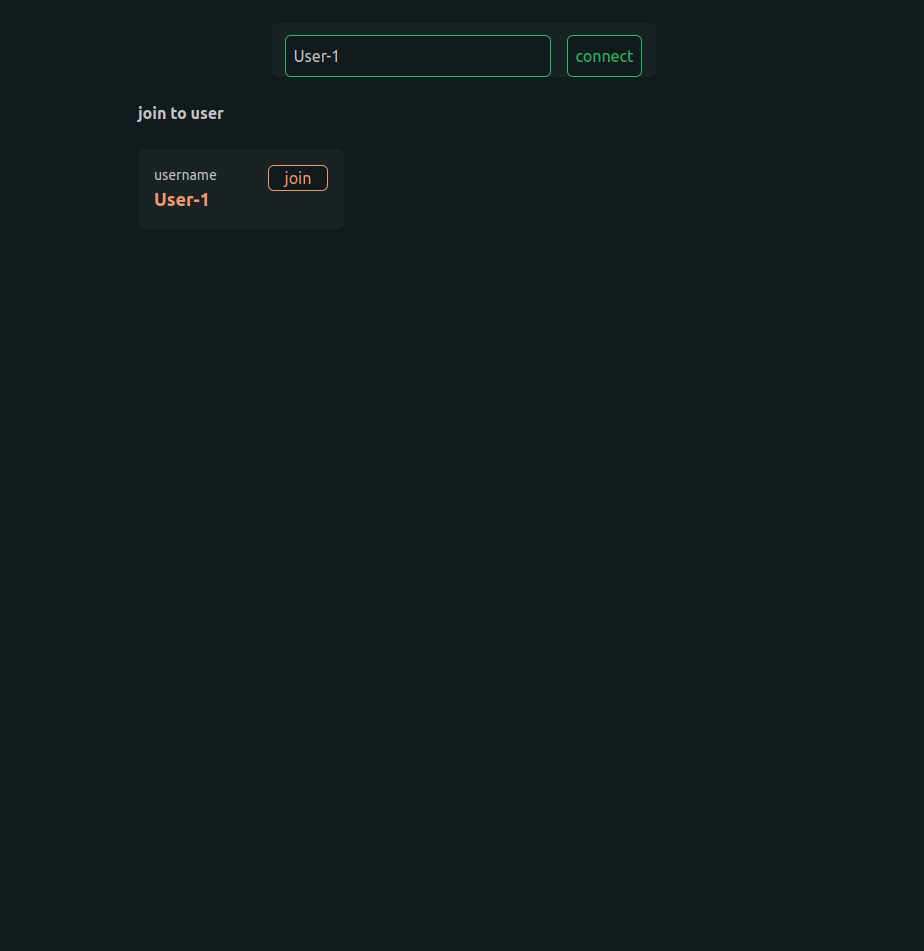
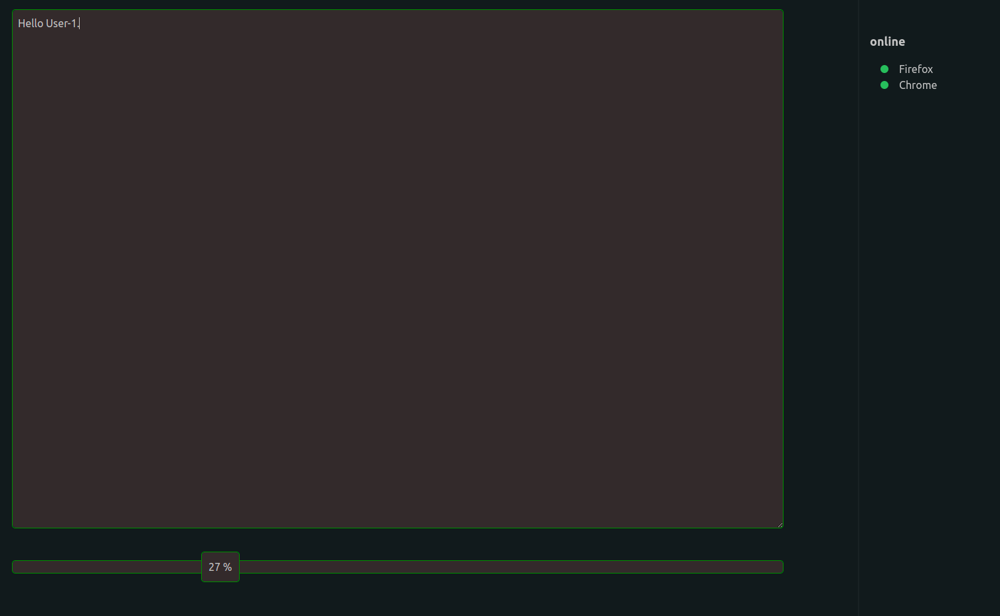
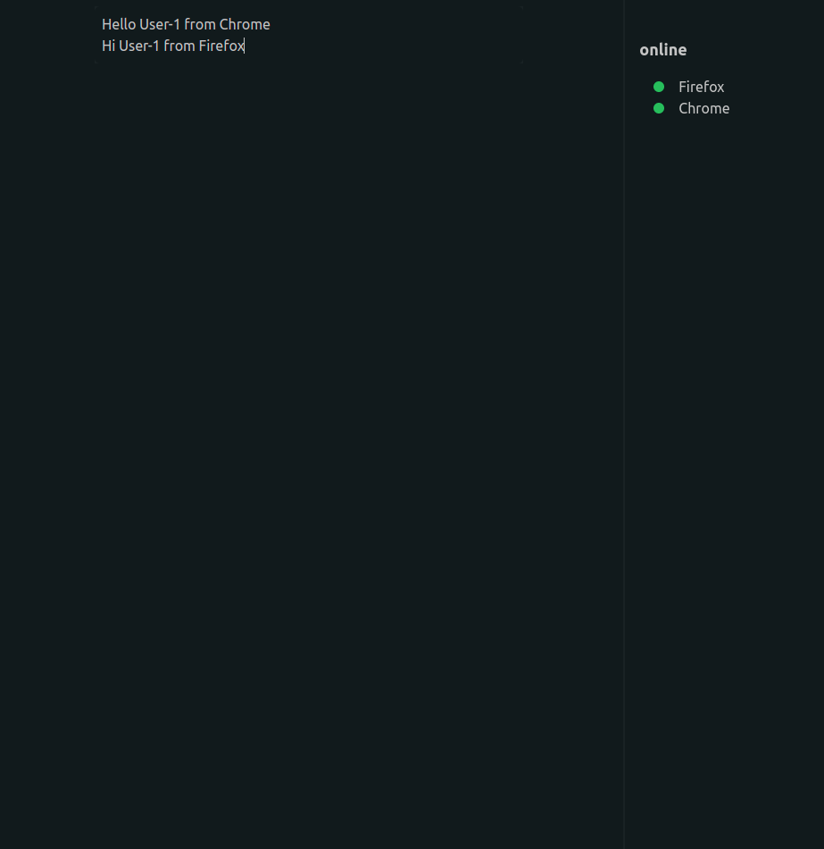
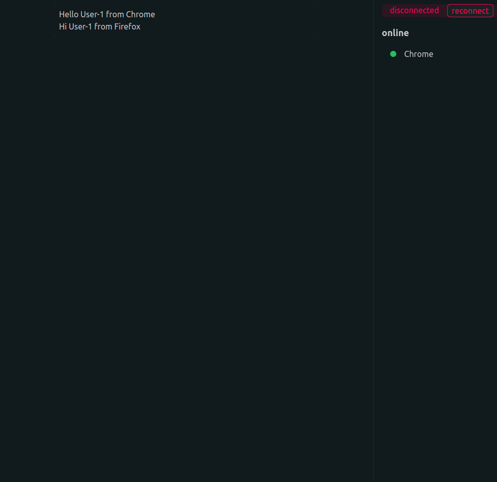

| Folder      | Description |
| ----------- | ----------- |
| server      | Golang API  |
| client      | Next JS     |

+ **Back End**
  - Golang 1.13+
  - Fiber
    - is an Express inspired web framework built on top of Fasthttp, the fastest HTTP engine for Go
    - ( https://github.com/gofiber/fiber )
  - Postgre SQL
  - Websocket
    - [The WebSocket Protocol](https://www.rfc-editor.org/rfc/rfc6455.txt)
    - ( https://github.com/gofiber/websocket ) Based on Fasthttp WebSocket for Fiber with available *fiber.Ctx methods like Locals, Params, Query and Cookies
    - ( https://github.com/fasthttp/websocket ) Gorilla WebSocket is a Go implementation of the WebSocket protocol
+ **Front End**
  - Node.js 12.0+
  - React.Js
  - Next.Js
  - Tailwind Css

```shell script
> npm install
> npm run-script build
> yarn start
```

1. `register`: http://localhost:3000/register
   
2. `login`: http://localhost:3000/login
   
3. `connect`: http://localhost:3000/app
   
   
   
   
   
4. `synchronized`: http://localhost:3000/app
   
   
5. `disconnected`: http://localhost:3000/app
   
