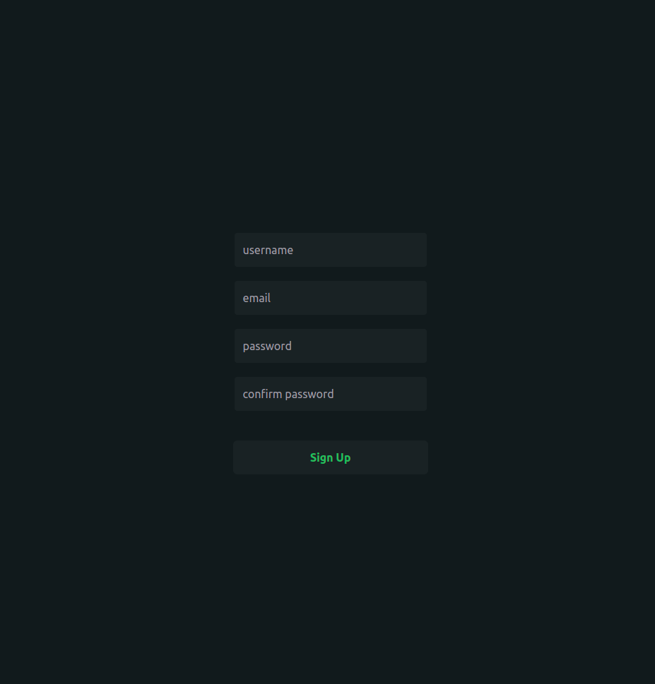
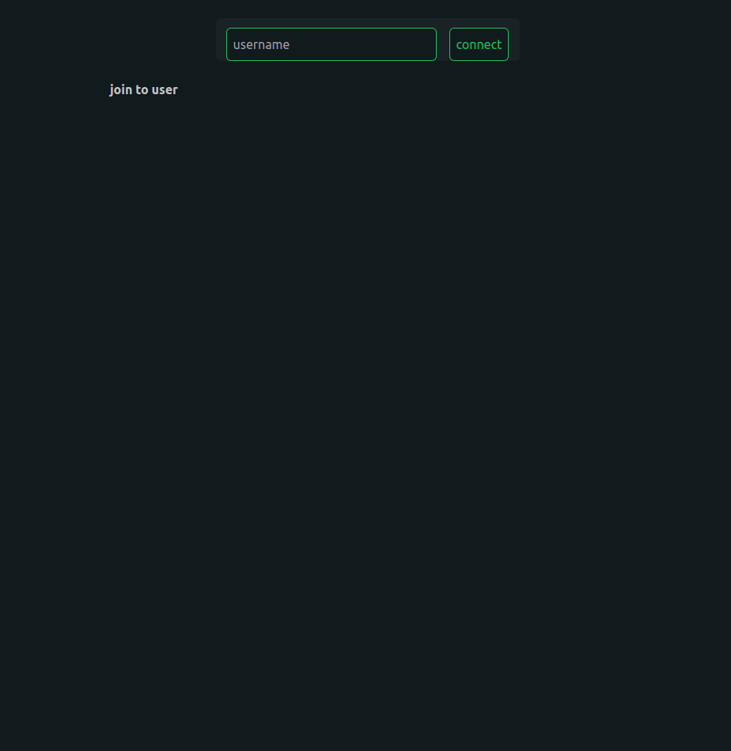

| Folder      | Description |
| ----------- | ----------- |
| Futa        | Golang API  |
| Mashu       | Next JS     |

+ **Front End**
  - Node.js 12.0+
  - React.Js
  - Next.Js
  - Tailwind Css

```shell script
> npm install
> npm run-script build
> yarn start
```

1. http://localhost:3000/register
   
2. http://localhost:3000/login
   
3. http://localhost:3000/app
   
   
   
   
   
