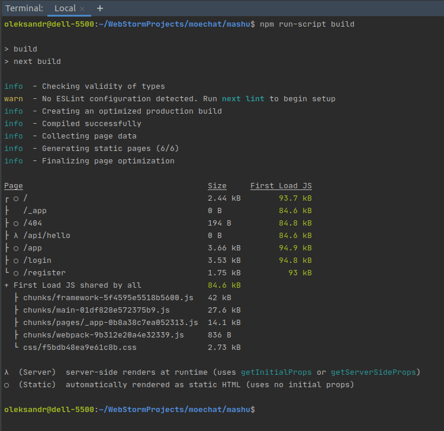

# A simple chat app with golang and react.js

* `Tutorial`: https://reactjsexample.com/a-simple-chat-app-with-websocket-golang-and-react-js
* `Repo`: https://github.com/nekonako/moechat
* `Repo (mashu)`: https://github.com/nekonako/moechat/tree/master/mashu

### structure

| Folder      | Description |
| ----------- | ----------- |
| Futa        | Golang API  |
| Mashu       | Next JS     |

##### Welcome to Mashu


### tech stack
+ **Front End**
  - React Js
  - Next Js
  - Tailwind Css
+ **Other**
  - docker
  - google cloud for the server
  - github action for ci/cd for the back end
  - vercel for deploy the front end

```shell script
> yarn install
> npm run-script build
> yarn start
```





---

* [Next.js — Краткое руководство 1](https://pxstudio.pw/blog/chto-takoe-next-js-i-dlya-chego-on-nuzhen)
* [Next.js — Краткое руководство 2](https://pxstudio.pw/blog/poluchenie-dannyh-v-next-js)
* [Next.js — Краткое руководство 3.1](https://nextjs.org/docs)
* [Next.js — Краткое руководство 3.2](https://nextjs.org/docs/getting-started)
* [Next.js — Краткое руководство 3.3](https://nextjs.org/learn/basics/create-nextjs-app/setup)
* [Next.js — Краткое руководство 3.4](https://nextjs.org/docs/api-reference/cli)
* [Next.js — Краткое руководство 3.5](https://nextjs.org/learn/basics/create-nextjs-app)
  * `Next.js` — это фреймворк, основанный на **React**, который позволяет создавать веб-приложения с улучшенной производительностью с помощью дополнительных функций предварительного рендеринга, таких как полноценный рендеринг на стороне сервера (SSR) и статическая генерация страниц (SSG).
  * `Next.js` — лучше всего подходит, когда необходимо создать оптимизированный лендинг или домашнюю страницу, а также любые другие страницы, которые полагаются на органический поисковый трафик.
* Запуск приложения в разных режимах:
  * `build` — собирает приложение Next.js для Production;
  * `start` — запускает Next.js в режиме Production;
  * `dev` — запускает Next.js в режиме разработки;
* Требования и окружающая среде:
  * (помимо самого фреймворка Next.js) потребуются Node.js, `npm` version 12-16 и `npx` (обычно `npm` и `npx` одновременно устанавливаются при установке `Node.js`)
  * [Update node to v12 on ubuntu](https://stackoverflow.com/questions/60679889/update-node-to-v12-on-ubuntu)

* [Разница между протоколами TCP и UDP](http://pyatilistnik.org/chem-otlichaetsya-protokol-tcp-ot-udp)
  * `TCP` — гарантирует доставку пакетов данных в неизменных виде, последовательности и без потерь; TCP требует заранее установленного соединения;
  * `UDP` — обеспечивает более высокую скорость передачи данных и ничего не гарантирует; UDP соединения не требует; UPD не содержит функций восстановления данных;

**TCP — надежнее и осуществляет контроль над процессом обмена данными.**

**UDP — обеспечивает более высокую скорость передачи данных.**

