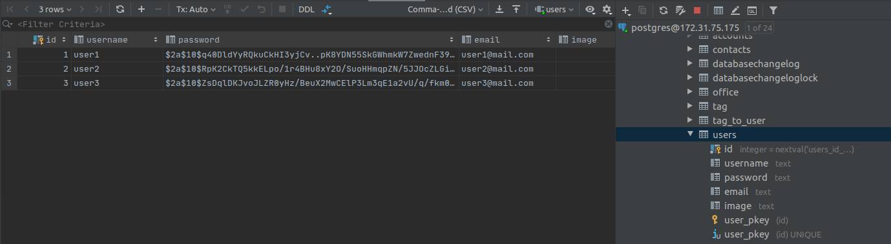
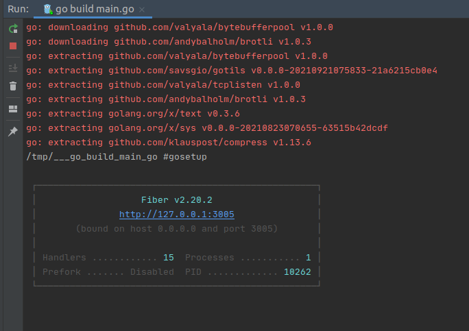
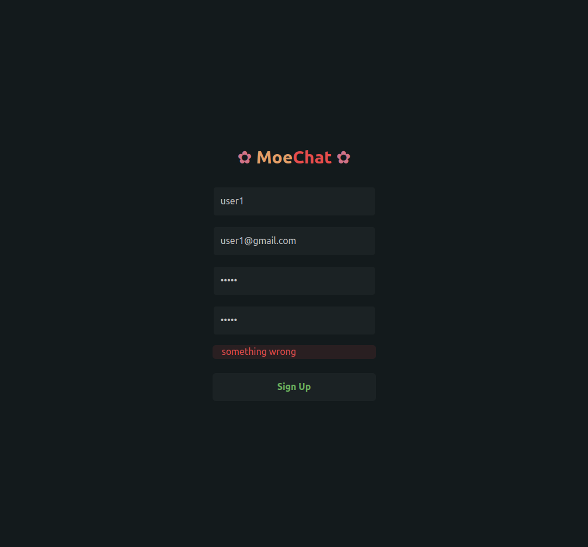
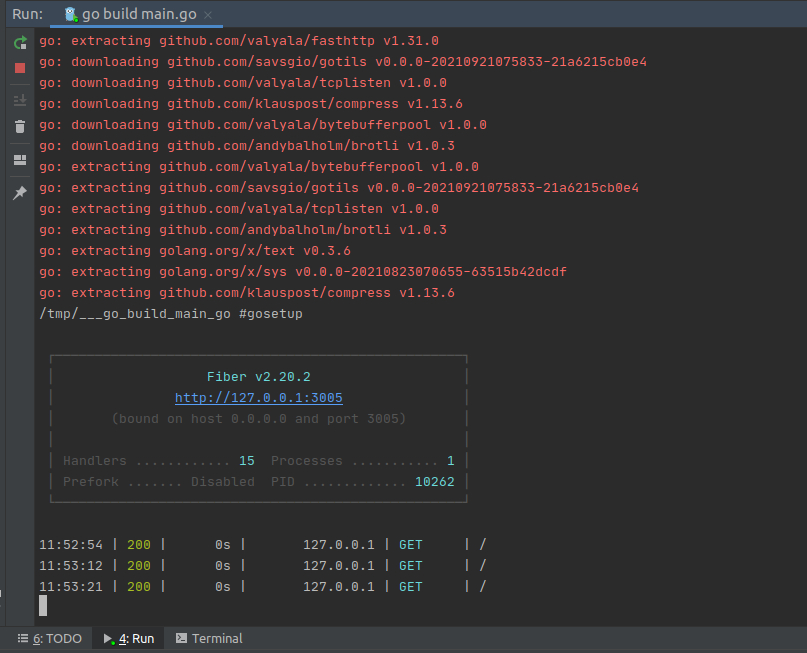

# A simple chat app with golang and react.js

* `Tutorial`: https://bestofreactjs.com/repo/nekonako-moechat-react-react-apps
* `Tutorial`: https://reactjsexample.com/a-simple-chat-app-with-websocket-golang-and-react-js
* `Repo`: https://github.com/nekonako/moechat
* `Repo (futa)`: https://github.com/nekonako/moechat/tree/master/futa

### structure

| Folder      | Description |
| ----------- | ----------- |
| Futa        | Golang API  |
| Mashu       | Next JS     |

##### Welcome to Futa

### tech stack
+ **Back End**
  - Golang 1.13+
  - Fiber
  - Postgre SQL
  - Websocket
+ **Other**
  - docker
  - google cloud for the server
  - github action for ci/cd for the back end
  - vercel for deploy the front end

```shell script
> go build main.go
```









