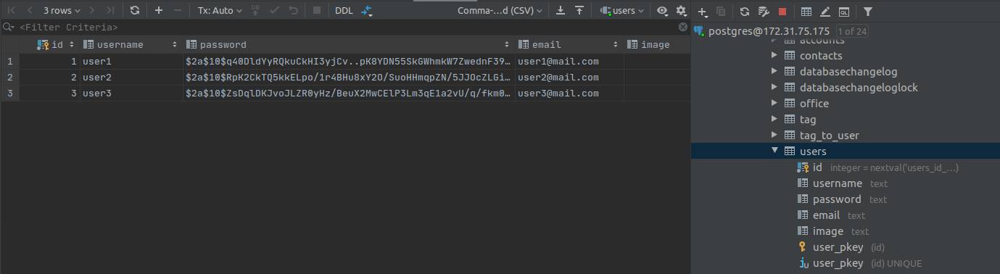
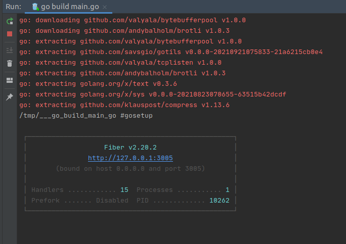
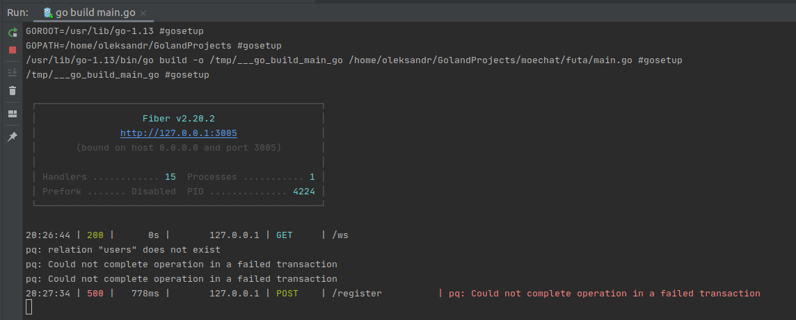
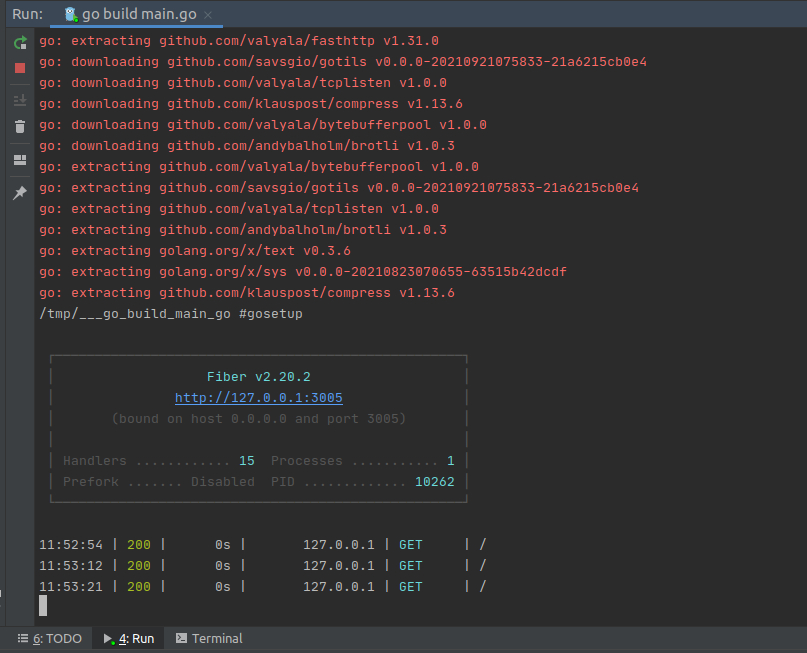

# A simple chat app with golang and react.js

* `Tutorial`: https://bestofreactjs.com/repo/nekonako-moechat-react-react-apps
* `Tutorial`: https://reactjsexample.com/a-simple-chat-app-with-websocket-golang-and-react-js
* `Repo`: https://github.com/nekonako/moechat
* `Repo (futa)`: https://github.com/nekonako/moechat/tree/master/futa

### structure

| Folder      | Description |
| ----------- | ----------- |
| server      | Golang API  |
| client      | Next JS     |

##### Welcome to Futa

### tech stack
+ **Back End**
  - Golang 1.13+
  - Fiber
    - is an Express inspired web framework built on top of Fasthttp, the fastest HTTP engine for Go
    - ( https://github.com/gofiber/fiber )
  - Postgre SQL
  - Websocket
    - [The WebSocket Protocol](https://www.rfc-editor.org/rfc/rfc6455.txt)
    - ( https://github.com/gofiber/websocket ) Based on Fasthttp WebSocket for Fiber with available *fiber.Ctx methods like Locals, Params, Query and Cookies
    - ( https://github.com/fasthttp/websocket ) Gorilla WebSocket is a Go implementation of the WebSocket protocol
+ **Other**
  - docker
  - google cloud for the server
  - github action for ci/cd for the back end
  - vercel for deploy the front end

```shell script
> go build main.go
```









